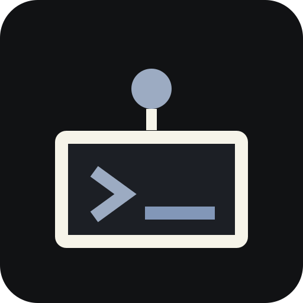
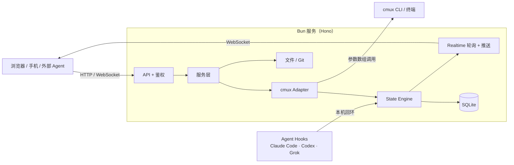

<div align="center">



# CMUX Agent Remote

运行在 Mac 上的多 Agent Web 控制中心：用浏览器或手机查看、控制 cmux 里的 Claude Code、Codex、Grok 和 Pi。

*See which agent is working and which one is waiting for you — from any browser.*


</div>

## 为什么做这个

同时开着好几个 Coding Agent 时，难的往往不是"怎么敲命令"，而是"谁还在干活、谁卡在等我批准、谁已经回完话没人看"。CMUX Agent Remote 跑在你自己的 Mac 上，把 cmux 里的 Workspace → Pane → Surface 结构和每个 Agent 的状态整理成一个网页，离开电脑也能用手机及时接手。

```text
Agent → cmux Surface → 本地服务 → 浏览器 / 手机
```

它不是通用远程终端，也不需要云端中转：服务只在本机运行，通过 cmux CLI 读画面、发输入，通过各 Agent 的原生 Hook 拿到准确的状态。

## 特性

**会话总览**

- 按 Workspace → Pane → Surface 展开结构树，支持搜索、折叠和"只看 Agent / 全部 surface"筛选。
- 状态分为工作中、等待批准、等待输入、已回复未读、空闲、可能停滞、错误，按需要处理的优先级排序。
- 顶栏与 workspace 角标汇总运行中和待处理的会话；可新建 workspace、分屏和 surface，重命名或关闭会话，修改同步到 cmux。

**终端查看与控制**

- 基于 `cmux rpc terminal.replay` 的彩色网格画面，保留颜色、样式和光标，能正确显示全屏 TUI。
- 普通屏可向上加载更早历史；全屏 TUI 通过翻页按钮或手势让真实程序翻页。
- 发送文本和控制键（Ctrl+C、Esc、Option+↑ 等），草稿按会话保存在页面内存，发送结果未知时保留草稿并禁止重复发送。
- 网页新建 Agent 只使用服务端白名单命令，前端只传 Agent 类型。

**文件、附件与 Git**

- 浏览当前用户有权限的整台 Mac 文件：筛选、递归搜索、文本内容搜索，预览文本、代码、图片和音视频，支持新建、重命名、复制、移动、废纸篓与二次确认的永久删除。
- 输入框可上传手机文件、拖入或粘贴截图、引用 Mac 上已有文件，发送时展开为绝对路径。
- 查看仓库分支、变更、上游领先 / 落后、提交历史和 Diff；只读浏览，不执行 pull、checkout 或提交。

**接入与部署**

- 外部 Agent 直接通过 HTTP / WebSocket 操作，无需安装 Skill、MCP 或 SDK；接口指南在运行时 `/agent-guide.md` 匿名可读。
- 可选安装 Claude Code、Codex、Grok 的 Hook，提高状态识别精度；Pi 通过进程识别和输出变化推断状态。
- 支持本机、局域网、Tailscale Serve 私有访问和 HTTPS 隧道 / 反向代理；前端可作为 PWA 添加到手机主屏。

## 快速开始

需要 macOS、[Bun](https://bun.sh) 和 [cmux](https://github.com/manaflow-ai/cmux)，且 `cmux` 命令在 PATH 中。先在 cmux 中打开要管理的会话，然后在仓库根目录执行：

```bash
git clone https://github.com/Helios5018/cmux-agent-remote.git
cd cmux-agent-remote
bun install
bun run build
bun run start            # 默认监听 127.0.0.1:4318
```

打开 `http://127.0.0.1:4318`，输入启动日志中打印的 Access PIN（首次生成后保存在数据库中复用，请勿公开分享日志）。

服务需要常驻时，放进 tmux 或你习惯的进程管理器即可。仓库内的部署脚本和文档示例使用 tmux 托管服务：

```bash
tmux new-session -d -s agent-remote-web 'bun run start'
tmux capture-pane -pt agent-remote-web -S -80   # 查看日志（含 PIN）
tmux kill-session -t agent-remote-web           # 停止服务
```

几个常用选项：

| 命令 | 作用 |
| --- | --- |
| `bun run start -- --demo` | 使用假会话数据体验界面，不需要 cmux；文件接口仍访问真实 Mac |
| `bun run start -- --lan` | 监听 `0.0.0.0`，同一局域网的手机可访问 |
| `bun run start -- --help` | 查看全部启动参数 |
| `bun run install-hooks` | 可选，安装 Agent Hook，提高状态识别精度 |

通过网页新建 Agent 前，需要把启动命令配置成本机可用的命令。默认值 `c-d`、`codex-d`、`g-d` 是自定义 Shell 别名，新安装通常要覆盖：

```bash
CAR_LAUNCH_CLAUDE=claude CAR_LAUNCH_CODEX=codex CAR_LAUNCH_GROK=grok CAR_LAUNCH_PI=pi bun run start
```

查看和控制已有会话不依赖这些配置。远程访问、PIN 轮换与更新方式见 [部署指南](docs/deployment.md)。

## 外部 Agent 接入

给 Agent 提供可达的服务根地址、Access PIN 和本次授权范围。其他机器不能使用这台 Mac 的 localhost 地址。可复制以下说明，PIN 通过私密会话或凭证工具单独提供：

```text
请通过 Agent Remote 操作我的 Mac。
服务根地址：<baseUrl>
使用指南：<baseUrl>/agent-guide.md
Access PIN：从本次私密会话或指定凭证来源获取
任务及授权范围：<项目目录、目标会话、允许执行的操作>

按指南登录并复用 Cookie，核对实例和目标会话的 UUID、程序、目录后执行。
通过输出与产物验证结果；输入或创建请求超时，先观察现场，不自动重发。
```

最短流程是 `POST /api/auth/login` → `GET /api/info` → `GET /api/tree` → `GET /api/surfaces/<UUID>/context` → 核对后 `POST .../input`。完整合同、Python 示例和失败恢复见 [Agent 接入指南](docs/agent-guide.md)。运行时 `/agent-guide.md` 匿名可读，业务接口需要登录。

## 安全模型

> [!WARNING]
> 这是单用户应用。登录后即可控制终端，并以运行服务的 macOS 用户权限读写文件，文件访问不限于项目目录。没有只读模式、多用户隔离或内置 2FA。

- **认证**：人用短 Access PIN 登录，之后使用 HttpOnly、SameSite=Lax 的 Session Cookie，HTTPS 下加 Secure。PIN 登录按来源指数锁定，另有全局失败闸门。
- **Hook 隔离**：Hook 使用独立长密钥，接收端只接受本机回环且拒绝带 `X-Forwarded-For` 的请求；Hook 脚本任何失败都 exit 0，不影响 Agent。
- **命令执行**：调用 cmux 使用参数数组，不经过 shell；新建 Agent 只执行服务端白名单命令。写操作显式指定目标 `surfaceId`，不依赖"当前终端"。
- **数据**：数据默认存于 `~/.cmux-agent-remote/`。SQLite 保存状态、配置、Session 与审计元数据，不存终端全文和 prompt；网页草稿只在页面内存中。
- **网络暴露**：默认只监听 `127.0.0.1`。个人设备远程访问推荐 Tailscale Serve；公网入口应使用 HTTPS 并在入口层限制访问者，限流不能代替可信网络入口。

细节见 [部署指南：数据与权限](docs/deployment.md#数据与权限)。

## 架构



cmux 提供拓扑、进程、画面和控制；Hook 提供回合、工具、批准与结束等语义事件；没有 Hook 时按输出变化推断状态。只有正在查看的 surface 读取彩色网格并以 400 ms 刷新，后台 Agent 按状态分级轮询。

```text
apps/server/    Bun + Hono 服务：api、services、cmux、hooks、state、realtime、security
apps/web/       React 18 + Vite 前端（PWA）
packages/protocol   前后端共享的 Zod schema、类型与注意力分组
packages/shared     时间、文本清洗、缓存等纯函数
scripts/        Hook 脚本、安装 / 卸载、HTTP 真机验收
docs/           使用、部署、开发、Agent 接入四篇指南
```

## 文档

| 文档 | 适用任务 |
| --- | --- |
| [使用指南](docs/usage.md) | 管理会话、输入与附件、文件操作、Git 浏览 |
| [部署指南](docs/deployment.md) | 启动配置、远程访问、更新、认证与排障 |
| [开发指南](docs/development.md) | 本地开发、架构、cmux / Hook 集成与验证 |
| [Agent 接入指南](docs/agent-guide.md) | HTTP / WebSocket 合同、示例与失败恢复 |

## 开发与测试

```bash
bun install --frozen-lockfile
bun run dev          # API watch，端口 4318
bun run dev:web      # 前端 4319，代理 API 到 4318

bun run typecheck    # tsc -b
bun run test         # Vitest
bun run build        # 产物在 apps/web/dist
```

需要真实 cmux 的 HTTP 端到端验收时运行 `python3 scripts/verify-agent-http.py`，它会用 tmux 启动隔离的测试服务和测试 workspace，结束后清理。开发约定与 cmux 集成约束见 [开发指南](docs/development.md)。

## 当前边界

- 当前版本 v0.1.0，能力以本文与四篇指南为准。
- 终端采用 cmux 画面同步，不是完整终端模拟器；回看历史与交互能力受 cmux 限制，例如 replay 回滚最多 240 行、不能由本应用修改终端列数。
- 未做：多用户、云端 Relay、独立 tmux 任务管理、Project 聚合。Pi 目前没有精确生命周期 Hook。
- 状态只用于判断何时接手，不是任务成功协议；完成情况仍需核对输出与产物。

## 相关项目

- [Helios5018/cmux](https://github.com/Helios5018/cmux)：基于 [manaflow-ai/cmux](https://github.com/manaflow-ai/cmux) 的个人 fork，macOS 终端 / Agent 工作台，本项目的控制对象。
- [Helios5018/cmux-workspace-ui](https://github.com/Helios5018/cmux-workspace-ui)：cmux 自定义侧栏，展示用量、workspace 与 tmux。

## 许可证

[MIT](LICENSE)
